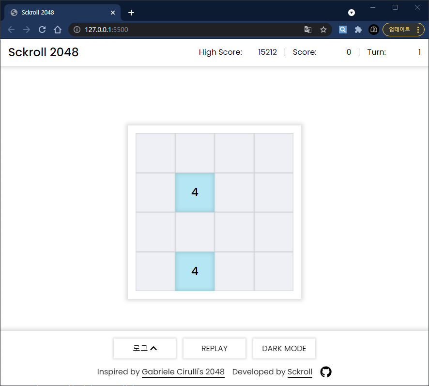
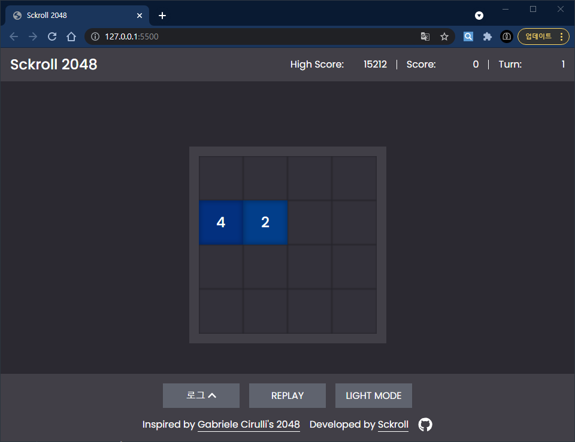
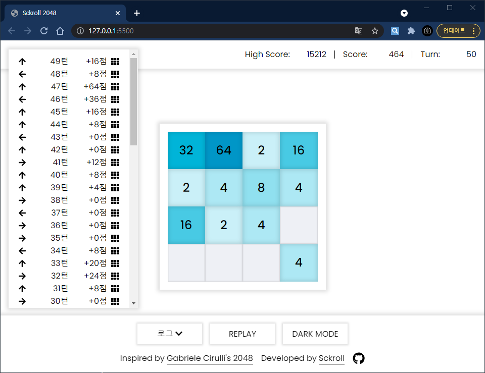
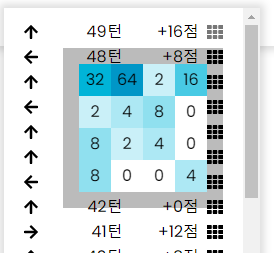
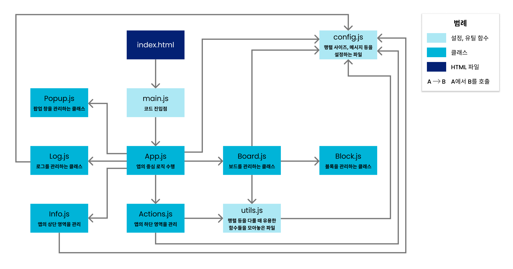
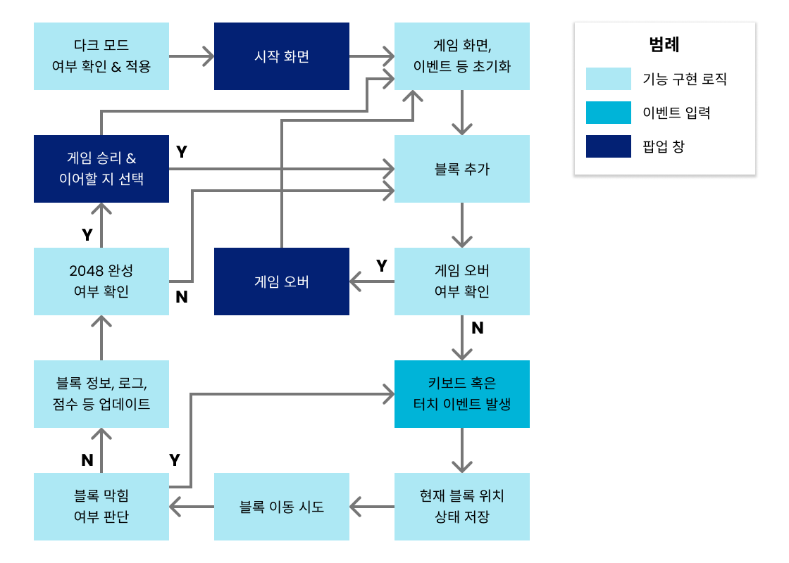

# Sckroll 2048

[게임 URL](https://sckroll-2048.netlify.app/)

## 개요

유명한 2048 게임([홈페이지](https://play2048.co/), [GitHub](https://github.com/gabrielecirulli/2048))을 클론하여 저만의 방식대로 구현해보았습니다.

GitHub에 올라온 해당 게임의 리포지토리 등 2048에 관련된 소스코드를 참고하지 않고 스스로 알고리즘을 구현했으며, 로그 기능과 같이 원작에는 없는 일부 기능을 추가하였습니다.

별도의 프레임워크 없이 Vanilla JS로 구현했으며, 순수 자바스크립로 직접 DOM을 다뤄보고자 초기 HTML의 구조는 싱글 페이지 애플리케이션(SPA)의 구조를 모방하였습니다.

## 주요 기능 및 스크린샷

### 게임 화면 (데스크탑)

- 상단에는 `현재 점수`, `최고 점수`, `현재 턴`이 표시되며, 하단에는 `로그 창` 토글 버튼, `리플레이` 버튼, `다크 모드` 토글 버튼이 있습니다.
  - `최고 점수`와 `다크 모드` 상태는 `localStorage`에 저장합니다.
- 키보드 방향키로 블록을 이동할 수 있습니다.
- 화면 슬라이드로도 블록을 이동할 수 있습니다. 데스크탑과 모바일 모두 지원됩니다.
  - 데스크탑에서 마우스로 슬라이드하는 경우 `MouseEvent`를 사용했으며, 모바일 환경에서는 마우스 이벤트가 동작하지 않기 때문에 터치 입력을 받는 `TouchEvent`를 사용했습니다.

### 게임 화면 (모바일)

|||
|---|---|
|▲ 안드로이드 (갤럭시 S8+)|▲ iOS (아이폰 14 프로)|

- 미디어 쿼리로 반응형 디자인을 적용했으며, 모바일 환경에서도 플레이할 수 있습니다.

### 다크 모드

- `prefers-color-scheme` 미디어 쿼리로 시스템 색상 여부를 판단하여 초기 실행 시의 색상 모드를 결정하도록 구현했습니다.
- 하단의 `다크 모드` 토글 버튼을 눌러서 색상 모드를 전환할 수 있습니다.

### 로그 기능

- 지금까지 이동한 블록의 정보(방향, 획득한 점수, 블록의 위치)를 로그 형식으로 볼 수 있습니다.
- 각 아이템의 가장 우측에 있는 아이콘에 마우스를 올리면 해당 턴에서의 블록 위치를 확인할 수 있습니다.

## 전체 구조 및 흐름

전체 구조는 다음과 같습니다.

게임의 흐름은 다음과 같이 구성했습니다.

## 그 외

게임에 사용된 알고리즘과 회고는 블로그에 업로드한 [포스트](https://sckroll.github.io/projects/2048)를 참고해주시기 바랍니다.