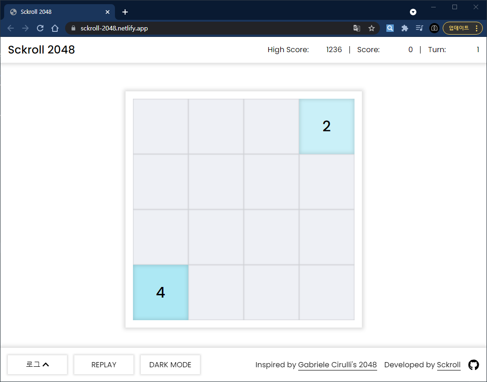
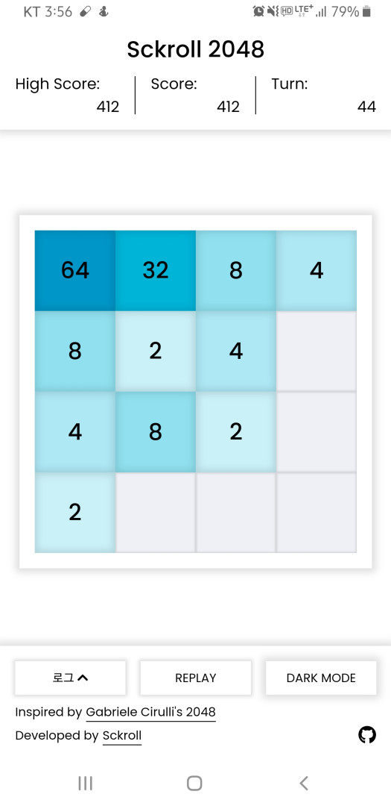
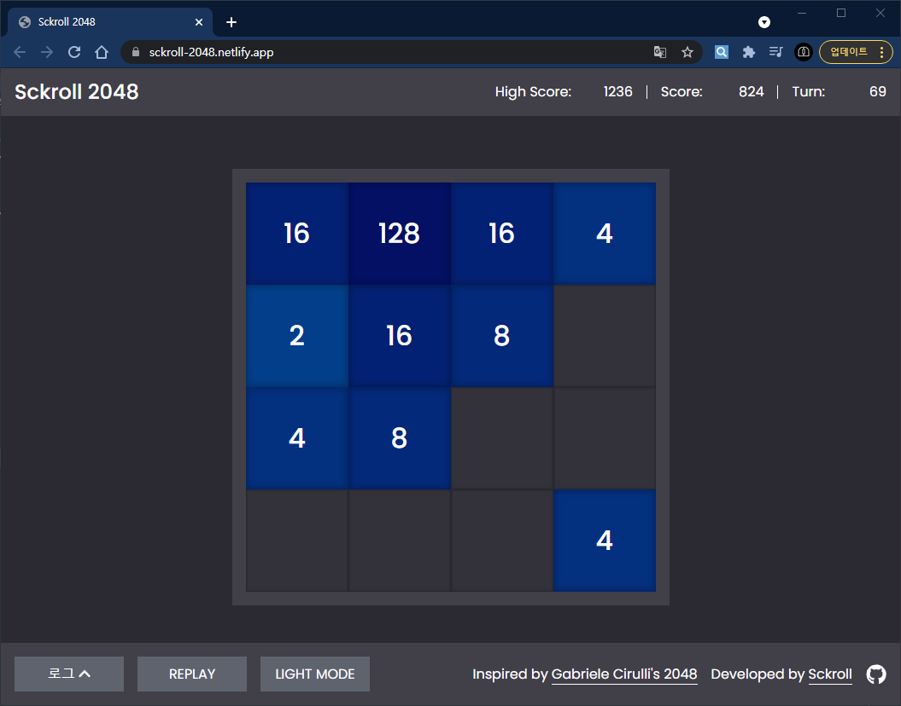
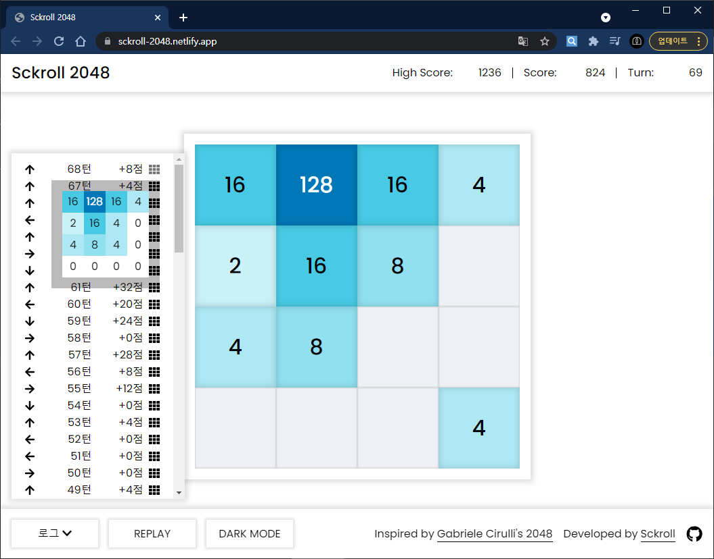

# Sckroll 2048

https://sckroll-2048.netlify.app/

한때 유행했던 2048([홈페이지](https://play2048.co/), [GitHub](https://github.com/gabrielecirulli/2048)) 게임을 클론하여 저만의 방식대로 구현해보았습니다.

오직 HTML, CSS, Vanilla JS로만 구현하였으며, 순수 자바스크립트로 DOM을 다뤄보는 것이 이 프로젝트의 목적이기 때문에 초기 HTML의 구조는 싱글 페이지 애플리케이션(SPA)의 구조를 모방하였습니다.

## 구현한 주요 기능

- 현재 점수, 최고 점수, 현재 턴 표시
- 방향 키로 블록 이동
- 화면 슬라이드로 블록 이동 (PC, 모바일 모두 지원)
- 다크 모드 토글
- 로그 기능
  - 이전 턴의 블록 배치 상태를 툴팁으로 확인 가능
  - 로그 표시 상태 토글
- 반응형 디자인

## 스크린샷

### 게임 화면 (PC)

  

### 게임 화면 (모바일)

  

### 다크 모드

  

### 로그 기능

  

