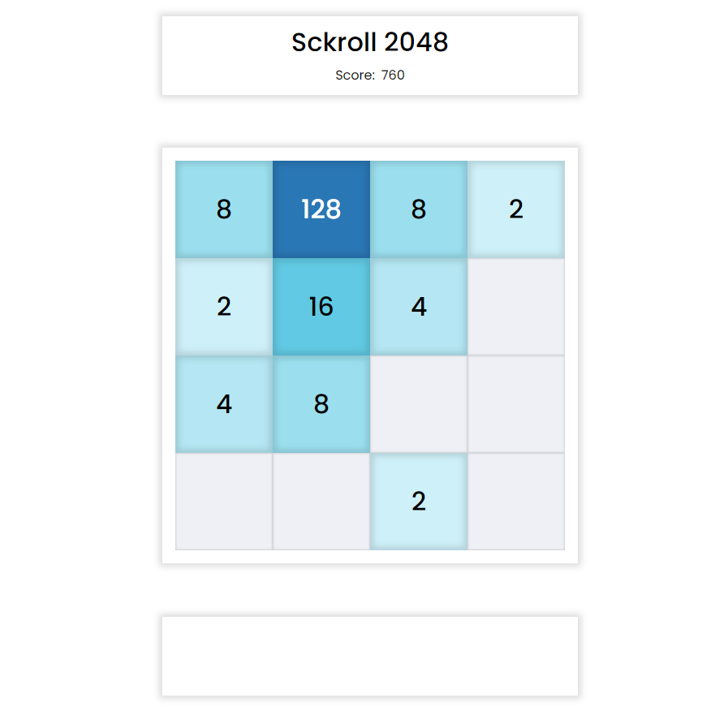

# Sckroll 2048

https://sckroll-2048.netlify.app/

한때 유행했던 2048([홈페이지](https://play2048.co/), [GitHub](https://github.com/gabrielecirulli/2048)) 게임을 클론하여 저만의 방식대로 구현해보았습니다.

오직 HTML, CSS, Vanilla JS로만 구현하였으며, 순수 자바스크립트로 DOM을 다뤄보는 것이 이 프로젝트의 목적이기 때문에 초기 HTML의 구조는 싱글 페이지 애플리케이션(SPA)의 구조를 모방하였습니다.

플레이 방법은 기존 2048과 동일하지만, 원작에는 없는 몇 가지 기능을 추가해보고자 합니다.

## 스크린샷

  

