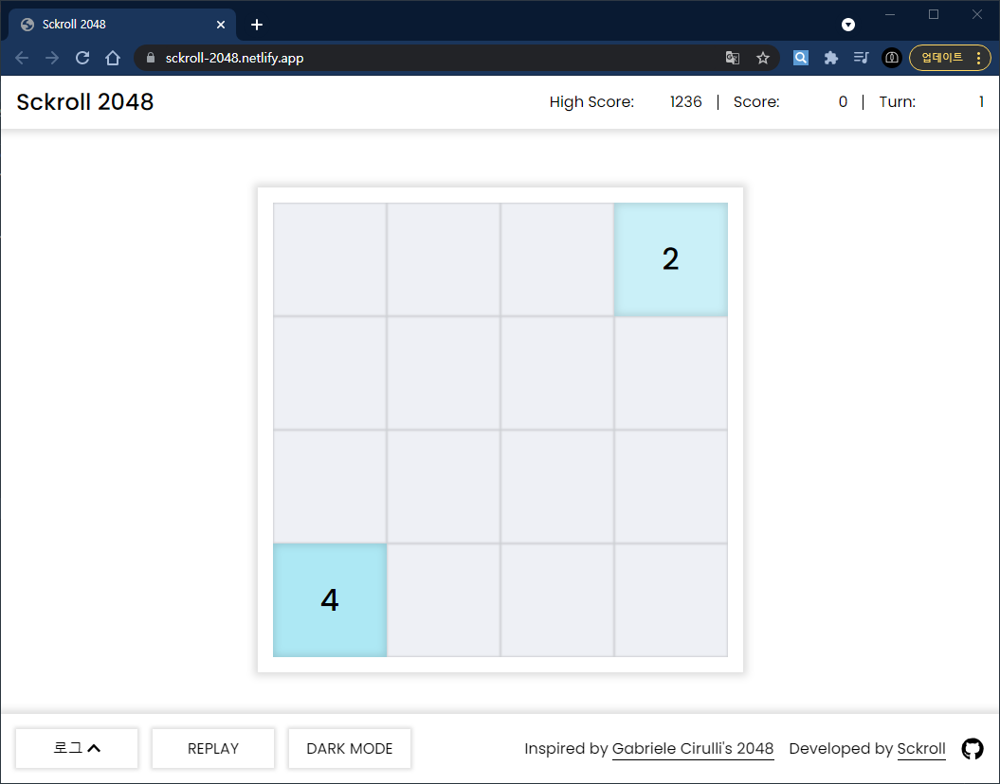
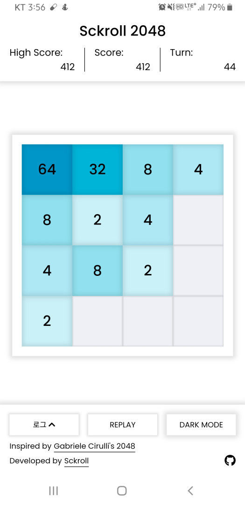
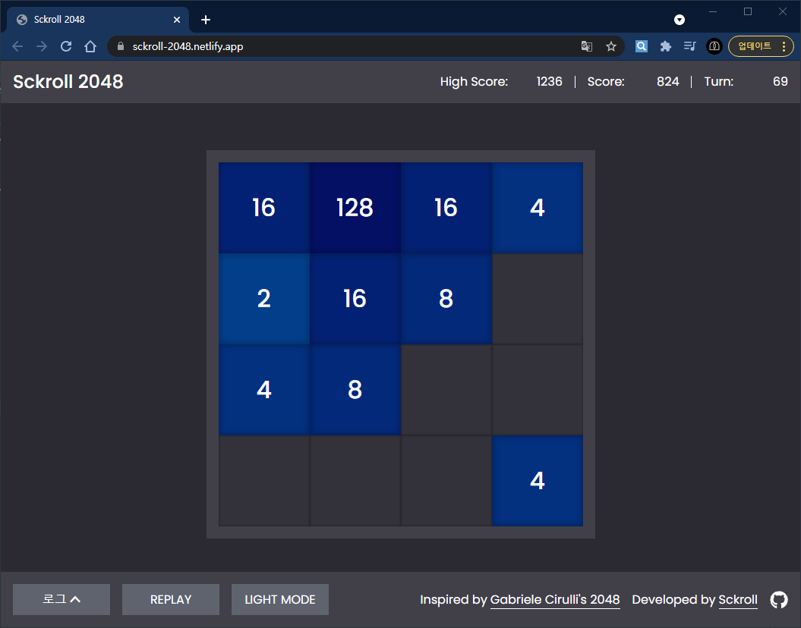
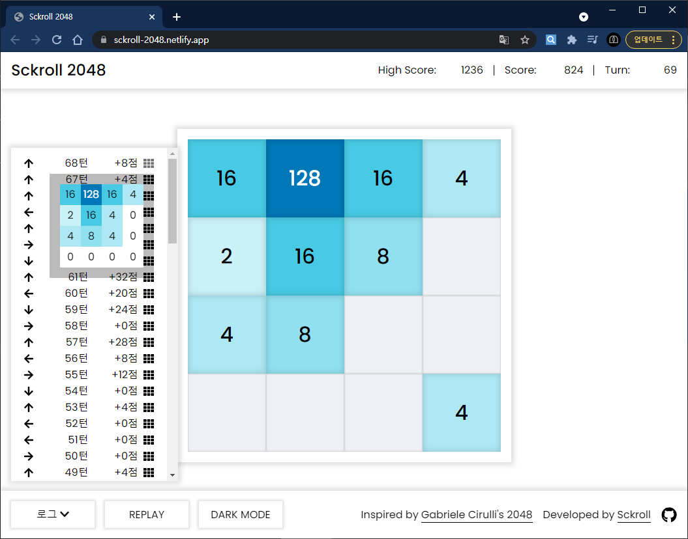

# Sckroll 2048

[링크](https://sckroll-2048.netlify.app/)

## 개요

유명한 2048([홈페이지](https://play2048.co/), [GitHub](https://github.com/gabrielecirulli/2048)) 게임을 클론하여 저만의 방식대로 구현해보았습니다.

오직 Vanilla JS로만 구현하였으며, 순수 자바스크립트로 직접 DOM을 다뤄보고자 초기 HTML의 구조는 싱글 페이지 애플리케이션(SPA)의 구조를 모방하였습니다.

프로젝트에 대한 상세 정보는 [여기](https://sckroll.github.io/projects/2048)에서 확인해주세요.

## 주요 기능 및 스크린샷

### 게임 화면 (데스크탑)

  

- 상단에는 `현재 점수`, `최고 점수`, `현재 턴`이 표시되며, 하단에는 `로그 창` 토글 버튼, `리플레이` 버튼튼, `다크 모드` 토글 버튼이 있습니다.
- 키보드 방향키로 블록을 이동할 수 있습니다.
- 화면 슬라이드로도 블록을 이동할 수 있습니다. 데스크탑과 모바일 모두 지원됩니다.

### 게임 화면 (모바일)

  

- 반응형 디자인을 적용했으며, 모바일 환경에서도 플레이할 수 있습니다.

### 다크 모드

  

- 시스템 환경에 따라 초기 실행 시 색상 모드가 결정되며, 하단의 `다크 모드` 토글 버튼을 눌러서 색상 모드를 전환할 수 있습니다.

### 로그 기능

  

- 지금까지 이동한 블록의 정보(방향, 획득한 점수, 블록의 위치)를 로그 형식으로 볼 수 있습니다.
- 각 아이템의 가장 우측에 있는 아이콘에 마우스를 올리면 해당 턴에서의 블록 위치를 확인할 수 있습니다.

## 구조 및 알고리즘

### 구조

작성 중입니다.

### 사용 알고리즘

작성 중입니다.